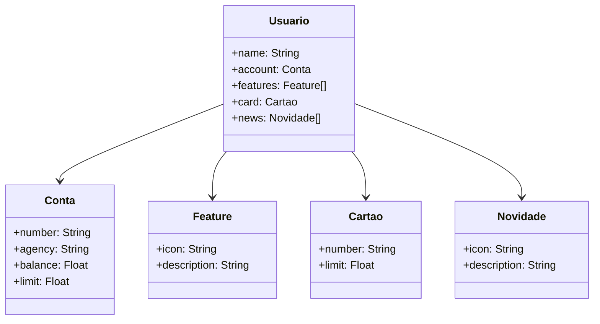

Reproduzindo o projeto da DIO 

JAVA Santander Dev week

Diagram Class

```mermaid
classDiagram
  class Usuario {
    +name: String
    +account: Conta
    +features: Feature[]
    +card: Cartao
    +news: Novidade[]
  }

  class Conta {
    +number: String
    +agency: String
    +balance: Float
    +limit: Float
  }

  class Feature {
    +icon: String
    +description: String
  }

  class Cartao {
    +number: String
    +limit: Float
  }

  class Novidade {
    +icon: String
    +description: String
  }

  Usuario --> Conta
  Usuario --> Feature
  Usuario --> Cartao
  Usuario --> Novidade
```
